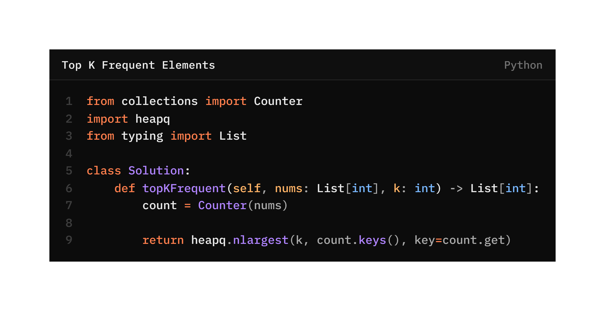

# Top K Frequent Elements

## Problem Statement
Given an integer array `nums` and an integer `k`, return the `k` most frequent elements. You may return the answer in **any order**.

**Example 1:**
- **Input:** `nums = [1,1,1,2,2,3], k = 2`
- **Output:** `[1,2]`

**Example 2:**
- **Input:** `nums = [1], k = 1`
- **Output:** `[1]`

---

## Visualization


---


```python
from collections import Counter

nums = [1,1,2,3,3,3]
count = Counter(nums)

print(count)
```

Counter({3: 3, 1: 2, 2: 1})
Keys → unique numbers
Values → frequency


# Concept 2: import heapq
What is a Heap?
A heap is a special data structure that helps you efficiently:

* Get the largest or smallest items

Python’s heapq is a min-heap by default.

```python
import heapq

nums = [5, 1, 8, 3]
heapq.heapify(nums)

print(nums)
```

```
[1, 3, 8, 5]
```

# Concept 3: heapq.nlargest()
It returns:
👉 The k largest elements, based on a comparison rule.

```python
import heapq

nums = [1, 10, 3, 5, 7]
print(heapq.nlargest(2, nums))
```

```
[10, 7]
``` 

# other methods


## count.keys()
This returns only the unique elements.

## key=count.get
```python
count = {1: 3, 2: 2, 3: 1}
count.get(1)  # → 3
count.get(2)  # → 2
count.get(3)  # → 1
```


```python
heapq.nlargest(k, count.keys(), key=count.get)
```
Step 1: What are we passing in?

* k → how many elements we want
* count.keys() → unique numbers
* key=count.get → compare by frequency


Step 2: Example Walkthrough
nums = [1,1,1,2,2,3]
k = 2
After Counter(nums):
count = {1: 3, 2: 2, 3: 1}
Now:
heapq.nlargest(2, [1,2,3], key=count.get)
Heap compares:

* 1 → 3
* 2 → 2
* 3 → 1

Top 2 → [1, 2]
✅ Returned as a list